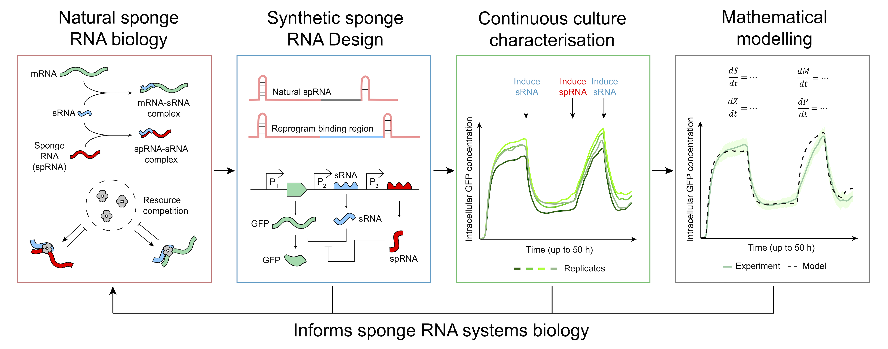

# Quantitative engineering and investigation of synthetic sponge RNAs in *E. coli*

This repository contains the code and data used to reproduce the main-text figures for:

**Stacey et al. (2026), "Quantitative Engineering and Investigation of Synthetic Sponge RNAs in *E. coli*"**

The manuscript develops synthetic sponge RNA (spRNA) circuits in *E. coli* and combines time-resolved continuous-culture characterisation, absolute fluorescent protein quantification, and mechanistic modelling to investigate spRNA-mediated regulation.

# Citation
If using this repository, please cite:

Stacey, S. B., Sechkar, K., Corrao, M., Steel, H., and Papachristodoulou, A. (2026). Quantitative Engineering and Investigation of Synthetic Sponge RNAs in *E. coli*.

Preprint: [https://doi.org/10.64898/2026.05.19.726096](https://doi.org/10.64898/2026.05.19.726096)

# Contact
For questions about the repository or manuscript, please contact:

Scott B. Stacey

Department of Engineering Science

University of Oxford

scott.stacey@eng.ox.ac.uk

## License

Code in this repository is licensed under the MIT License.

Data, figures, documentation, and other non-code materials are licensed under a
[Creative Commons Attribution-NonCommercial 4.0 International License](https://creativecommons.org/licenses/by-nc/4.0/),
matching the license used for the bioRxiv preprint.
